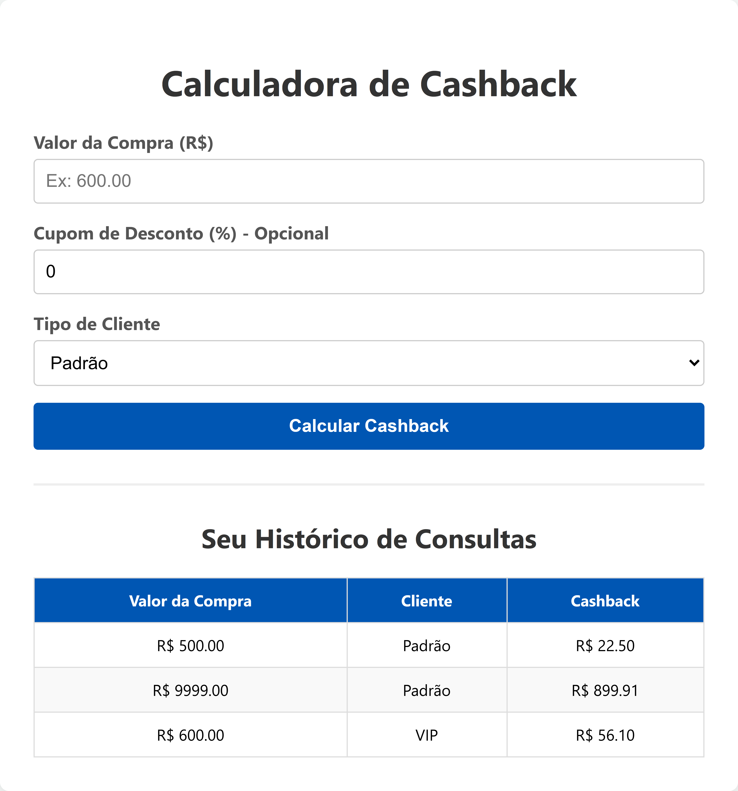

# Calculadora de Cashback - Desafio Nology

**Acesse a aplicação online:** [Calculadora de Cashback](https://daviguimaraes-desafio-nology.vercel.app/)

Este repositório contém a solução técnica para o desafio de desenvolvimento da Nology, implementando as regras de negócio de cálculo de cashback e uma aplicação Full Stack.

Desenvolvido por **Davi de Mendonça Teles Guimarães**.

## Demonstração da Interface

Aqui está uma prévia da aplicação em funcionamento, apresentando o cálculo de cashback e o histórico filtrado por IP:

<p align="center">
  
</p>

## Estrutura do Projeto

O projeto foi dividido para atender a todas as etapas do enunciado de forma organizada:

- **`calculo_basico.py`** (Raiz): Script em Python puro com a lógica de cálculo via terminal, respondendo aos requisitos das **Questões 1 a 4**.
- **`/backend`**: API desenvolvida em Python com Flask, responsável pelo cálculo remoto e persistência no banco de dados (**Questão 5**).
- **`/front`**: Interface web estática em HTML, CSS e JavaScript puro, integrada à API (**Questão 5**).

## Tecnologias Utilizadas

- **Lógica e Backend:** Python 3, Flask
- **Frontend:** HTML5, CSS3, JavaScript
- **Banco de Dados:** PostgreSQL (Hospedado no Render)
- **Deploy:** Railway (API) e Vercel (Frontend)

## Para Questões 1 a 4

Para testar apenas o cálculo das regras de negócio pelo terminal, rode o seguinte comando na raiz do projeto:

```bash
python calculo_basico.py